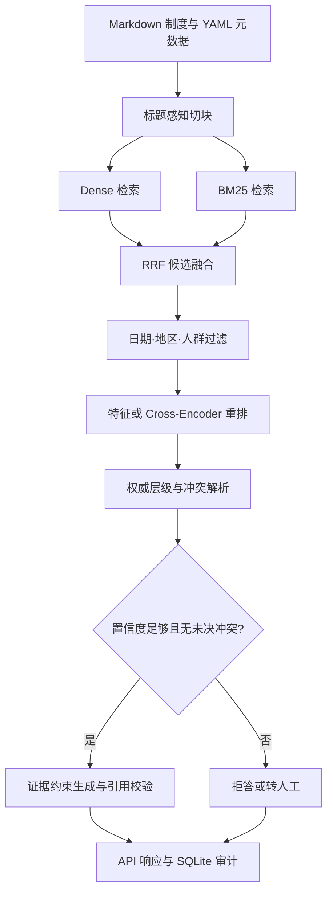

# VeriPolicy-RAG

一个面向企业制度的时效、适用范围、权威层级与冲突感知 RAG。项目重点解决一个真实问题：同一制度存在多个版本、地区补充条款和人群例外时，普通向量检索会把已经失效或不适用的规则送给大模型，最终生成看似合理的错误答案。


## 已完成的效果

仓库内置 29 份虚构但真实风格的版本化企业制度、83 个结构化 chunk 和 108 条评测问题。评测集包含旧版本、地区差异、员工类型、同级制度冲突、跨中英文表达和不可回答问题。54 条用于阈值校准，54 条作为测试集；测试问题采用与开发集不同的问法。

以下结果由 `python -m veripolicy.cli eval ...` 在 CPU 可复现配置上实跑生成：

| Pipeline | Hit@1 | Hit@3 | MRR@10 | 规则值准确率 | 错版本/错范围@1 |
|---|---:|---:|---:|---:|---:|
| LSA Dense baseline | 35.4% | 77.1% | 57.7% | 50.0% | 50.0% |
| Dense + BM25 + RRF | 39.6% | 85.4% | 62.0% | 50.0% | 50.0% |
| + 时间/地区/人群过滤 | 77.1% | 89.6% | 84.0% | 97.9% | 0% |
| + 可解释特征重排（full） | **83.3%** | **89.6%** | **87.7%** | **97.9%** | **0%** |


这组数字对应轻量 CPU profile，Dense 组件是 TF-IDF + Truncated SVD 的 LSA，用于让任何电脑都能复现实验。生产 profile 已接好 `Qwen/Qwen3-Embedding-0.6B` 和 `Qwen/Qwen3-Reranker-0.6B`，切换模型后应重新跑评测，不能沿用上表数字。

## 系统架构



核心设计：

- 版本感知：每份制度包含 `effective_from` 和 `effective_to`，查询也携带 `as_of`。历史问题能找回旧版本，当前问题不会混入已失效条款。
- 范围感知：地区和员工类型在召回阶段过滤；地区补充条款、正式员工、实习生和外包人员不会混用。
- 混合检索：Dense 处理语义表达，BM25 保留金额、缩写、制度名等精确词；使用 RRF 合并排名，避免直接比较不同尺度的分数。
- 两档重排：CPU profile 使用透明特征重排，方便逐项解释；生产 profile 可换成 Qwen3 Cross-Encoder。
- 冲突检测：同一 `rule_key` 出现不同值时，依次比较适用范围、文件权威等级和生效时间。同级有效文件仍冲突时强制停止作答。
- 可校准拒答：开发集选择阈值，证据不足时不让生成模型自由补全。
- 引用闭环：LLM 只能引用本次召回的 `chunk_id`；出现未知引用或无引用时，结果不会作为正常答案返回。
- 可观测性：保存 trace、置信度、引用、冲突、延迟和用户反馈，方便后续做失败样本挖掘。

检查数据：

```bash
python -m veripolicy.cli inspect --corpus data/corpus
```

问一个带时间和人群条件的问题：

```bash
python -m veripolicy.cli ask \
  --corpus data/corpus \
  --question "2025 年中国区实习生学习预算是多少？" \
  --as-of 2025-06-01 \
  --region CN \
  --employee-type intern
```

Windows PowerShell 可以把反斜杠换成反引号，或直接把命令写在一行。

运行完整消融实验：

```bash
python -m veripolicy.cli eval \
  --corpus data/corpus \
  --queries data/eval/queries.jsonl \
  --output artifacts/eval
```

