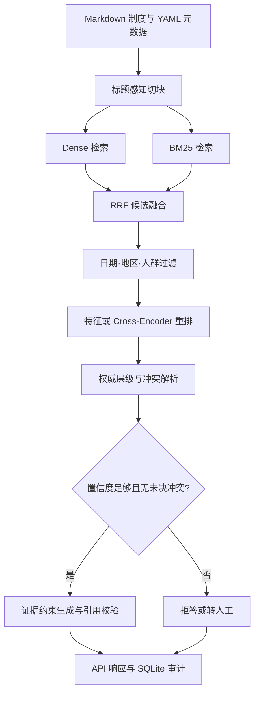

# VeriPolicy-RAG

一个面向企业制度的时效、适用范围、权威层级与冲突感知 RAG。项目重点解决一个真实问题：同一制度存在多个版本、地区补充条款和人群例外时，普通向量检索会把已经失效或不适用的规则送给大模型，最终生成看似合理的错误答案。

仓库没有使用 LangChain。摄取、切块、Dense/BM25 检索、RRF 融合、元数据过滤、重排、冲突解析、拒答、引用校验、评测、API 和 Agent Tool Schema 都能在代码中逐层追踪。

## 已完成的效果

仓库内置 29 份虚构但真实风格的版本化企业制度、83 个结构化 chunk 和 108 条评测问题。评测集包含旧版本、地区差异、员工类型、同级制度冲突、跨中英文表达和不可回答问题。54 条用于阈值校准，54 条作为测试集；测试问题采用与开发集不同的问法。

以下结果由 `python -m veripolicy.cli eval ...` 在 CPU 可复现配置上实跑生成：

| Pipeline | Hit@1 | Hit@3 | MRR@10 | 规则值准确率 | 错版本/错范围@1 |
|---|---:|---:|---:|---:|---:|
| LSA Dense baseline | 35.4% | 77.1% | 57.7% | 50.0% | 50.0% |
| Dense + BM25 + RRF | 39.6% | 85.4% | 62.0% | 50.0% | 50.0% |
| + 时间/地区/人群过滤 | 77.1% | 89.6% | 84.0% | 97.9% | 0% |
| + 可解释特征重排（full） | **83.3%** | **89.6%** | **87.7%** | **97.9%** | **0%** |

完整报告见 `artifacts/eval/report.md`，逐问题结果见 `artifacts/eval/per_query.jsonl`。拒答阈值只在开发集上选择；测试集不参与调参。

这组数字对应轻量 CPU profile，Dense 组件是 TF-IDF + Truncated SVD 的 LSA，用于让任何电脑都能复现实验。生产 profile 已接好 `Qwen/Qwen3-Embedding-0.6B` 和 `Qwen/Qwen3-Reranker-0.6B`，切换模型后应重新跑评测，不能沿用上表数字。

## 系统架构



核心设计：

- 版本感知：每份制度包含 `effective_from` 和 `effective_to`，查询也携带 `as_of`。历史问题能找回旧版本，当前问题不会混入已失效条款。
- 范围感知：地区和员工类型在召回阶段过滤；地区补充条款、正式员工、实习生和外包人员不会混用。
- 混合检索：Dense 处理语义表达，BM25 保留金额、缩写、制度名等精确词；使用 RRF 合并排名，避免直接比较不同尺度的分数。
- 两档重排：CPU profile 使用透明特征重排，方便逐项解释；生产 profile 可换成 Qwen3 Cross-Encoder。
- 冲突检测：同一 `rule_key` 出现不同值时，依次比较适用范围、文件权威等级和生效时间。同级有效文件仍冲突时强制停止作答。
- 可校准拒答：开发集选择阈值，证据不足时不让生成模型自由补全。
- 引用闭环：LLM 只能引用本次召回的 `chunk_id`；出现未知引用或无引用时，结果不会作为正常答案返回。
- 可观测性：保存 trace、置信度、引用、冲突、延迟和用户反馈，方便后续做失败样本挖掘。

## 五分钟跑起来

建议使用 Python 3.10—3.12。在项目根目录执行。

Windows PowerShell：

```powershell
py -3.12 -m venv .venv
.venv\Scripts\Activate.ps1
python -m pip install -U pip
pip install -e ".[api]"
```

macOS/Linux：

```bash
python3 -m venv .venv
source .venv/bin/activate
python -m pip install -U pip
pip install -e ".[api]"
```

检查数据：

```bash
python -m veripolicy.cli inspect --corpus data/corpus
```

问一个带时间和人群条件的问题：

```bash
python -m veripolicy.cli ask \
  --corpus data/corpus \
  --question "2025 年中国区实习生学习预算是多少？" \
  --as-of 2025-06-01 \
  --region CN \
  --employee-type intern
```

Windows PowerShell 可以把反斜杠换成反引号，或直接把命令写在一行。

运行完整消融实验：

```bash
python -m veripolicy.cli eval \
  --corpus data/corpus \
  --queries data/eval/queries.jsonl \
  --output artifacts/eval
```

运行测试：

```bash
python -m unittest discover -s tests -v
```

启动 API：

```bash
python -m uvicorn veripolicy.api:app --host 127.0.0.1 --port 8000
```

打开 `http://127.0.0.1:8000/docs`，可直接在 Swagger 页面测试 `/v1/search`、`/v1/ask`、`/v1/feedback` 和 `/v1/tools`。

## PyCharm 运行方法

1. 用 PyCharm 打开整个 `veripolicy-rag` 文件夹。
2. 选择项目解释器，推荐新建 Python 3.12 虚拟环境。
3. 在 Terminal 执行 `pip install -e ".[api]"`。
4. 新建 Python Run Configuration，Module name 填 `veripolicy.cli`。
5. Parameters 填：

```text
ask --corpus data/corpus --question "2025 年 P1 事件几分钟内确认？" --as-of 2025-04-01 --region CN --employee-type full_time
```

6. Working directory 必须是项目根目录。

## 切换到神经模型

先安装 ML 依赖：

```bash
pip install -e ".[api,ml]"
```

建议在有 NVIDIA GPU 的云端运行：

```bash
python -m veripolicy.cli eval \
  --corpus data/corpus \
  --queries data/eval/queries.jsonl \
  --output artifacts/eval_qwen \
  --dense-backend sentence-transformers \
  --embedding-model Qwen/Qwen3-Embedding-0.6B \
  --reranker cross-encoder \
  --reranker-model Qwen/Qwen3-Reranker-0.6B
```

选择这两个模型的理由：0.6B 规模兼顾部署成本与效果；支持中英文和 100 多种语言；上下文上限 32K；Embedding 和 Reranker 都支持任务指令。Qwen 官方模型卡还报告，自定义检索指令通常能带来 1%—5% 的提升。相关资料：

- [Qwen3-Embedding-0.6B model card](https://huggingface.co/Qwen/Qwen3-Embedding-0.6B)
- [Qwen3-Reranker-0.6B model card](https://huggingface.co/Qwen/Qwen3-Reranker-0.6B)
- [BGE-M3 model card](https://huggingface.co/BAAI/bge-m3)：可作为替代方案；它原生覆盖 dense、sparse 和 multi-vector retrieval。

显存有限时，可以先只换 Embedding，继续使用 `--reranker heuristic`。每次更换模型、切块参数或语料后都应重新生成指标。

## 接入生成模型

离线模式默认使用抽取式回答，因此不需要 API Key。若要测试完整生成链路：

```bash
cp .env.example .env
```

在 `.env` 中填写任意兼容 OpenAI Chat Completions 协议的地址、Key 和模型名，然后执行：

```bash
python -m veripolicy.cli ask \
  --question "2025 年报销必须在多少天内提交？" \
  --as-of 2025-06-01 \
  --region CN \
  --employee-type full_time \
  --generator llm
```

生成模型只负责根据已经选定的证据组织语言；检索、冲突判断、拒答与引用白名单都在生成之前或之后由确定性代码控制。

## 数据格式

每份 Markdown 文件使用 YAML front matter：

```markdown
---
doc_id: expense_cn_2025
title: 中国区费用报销规则（2025 版）
policy_family: expense
version: "2.0"
effective_from: 2025-01-01
effective_to: null
regions: [CN]
employee_types: [all]
authority: 75
---

# 中国区费用报销规则（2025 版）

## 提交期限

<!-- rule: {"key":"expense.submission_days","value":"15","label":"报销提交期限","statement":"费用须在发生后 15 天内提交报销。","aliases":["报销期限"]} -->

员工应及时提交费用……
```

`rule` 注释用于冲突检测、数值评测和抽取式 fallback，最终展示给用户的正文会移除这段注释。真实项目可由人工、规则或 LLM 离线抽取结构化 rule；线上回答阶段不应临时生成它。

评测集是 JSONL，每行包含问题、查询日期、地区、员工类型、相关文档、相关规则、期望值和标签。详细说明见 `docs/DATA_CARD.md`。

## 项目目录

```text
veripolicy-rag/
├── data/corpus/                  # 29 份版本化制度
├── data/eval/queries.jsonl       # 108 条开发/测试问题
├── artifacts/eval/               # 实跑指标、报告和逐题结果
├── scripts/generate_sample_data.py
├── src/veripolicy/
│   ├── ingest.py                 # front matter 校验与标题感知切块
│   ├── retrieval.py              # LSA / SentenceTransformer / BM25 / RRF
│   ├── scope.py                  # 日期、地区、人群与优先级
│   ├── rerank.py                 # 特征重排 / Cross-Encoder
│   ├── conflicts.py              # 规则冲突检测
│   ├── confidence.py             # 拒答置信度与阈值校准
│   ├── answering.py              # 抽取式与 LLM 生成、引用校验
│   ├── pipeline.py               # 主链路编排
│   ├── evaluation.py             # Hit@K、MRR、nDCG、消融实验
│   ├── agent_tools.py            # Agent 工具 schema 与版本比较工具
│   ├── audit.py                  # SQLite trace 与反馈
│   ├── api.py                    # FastAPI
│   └── cli.py                    # 命令行入口
├── tests/                        # 10 个端到端和单元测试
└── docs/                         # 学习、数据与面试说明
```

## Agent 升级接口

`GET /v1/tools` 已暴露两个 Function Calling schema：

- `search_policy`：按日期、地区和员工类型检索并回答。
- `compare_policy_versions`：分别在两个日期检索同一问题并返回变化规则和双侧证据。

下一阶段可以增加一个轻量 Planner，根据问题选择单次查询、版本比较、追问缺失条件或转人工。工具本身保持确定性，Agent 只负责路由，这样能限制错误传播。具体升级路线见 `docs/STUDY_GUIDE.md`。

## 复现实验时必须诚实说明

- 内置制度是虚构基准，不代表任何真实公司的政策，也不能用于法律或人事决策。
- 上表是 CPU profile 的结果；没有运行的神经模型不能写进结果表。
- 当前规模用于算法消融和端到端验证。接入真实语料后，需要重做切块、标注、阈值校准和延迟测试。
- 评测集每个规则有一个开发问法和一个测试问法，因此能检查改写鲁棒性，但不能替代跨公司、跨领域外部测试。

## 继续阅读

- `docs/STUDY_GUIDE.md`：今晚按什么顺序研究代码。
- `docs/INTERVIEW_GUIDE.md`：项目介绍、简历写法和高频追问。
- `docs/DATA_CARD.md`：数据集构造、划分和局限。

